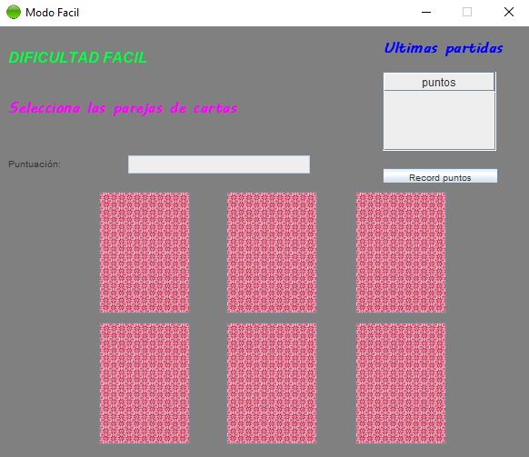
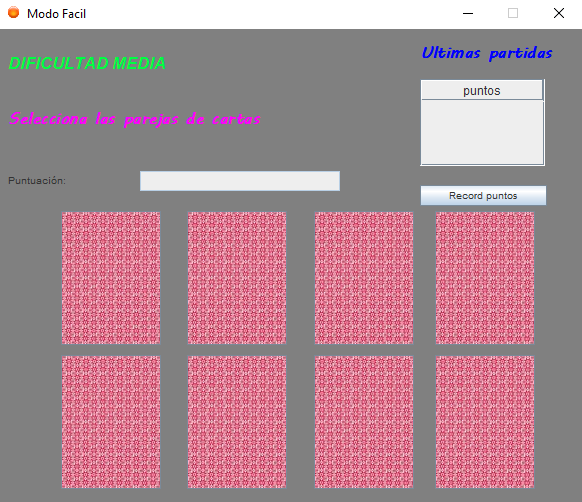
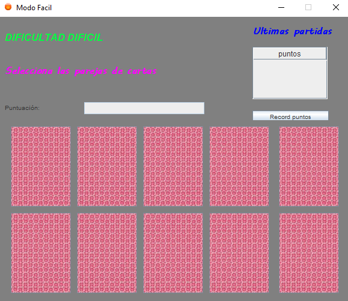

# Juego-Cartas-Memoria

## Este proyecto es un juego de memorizar las parejas de cartas contando con varios niveles y guardando el tiempo que se tarda en completar el juego

> [!IMPORTANT]
> Ventana Principal

> [!TIP]
> Nivel Facil

> [!WARNING]
> Nivel Medio

> [!CAUTION]
> Nivel Dificil

[Enlace al video de demostración](https://youtu.be/wGvPme3U0CU)

